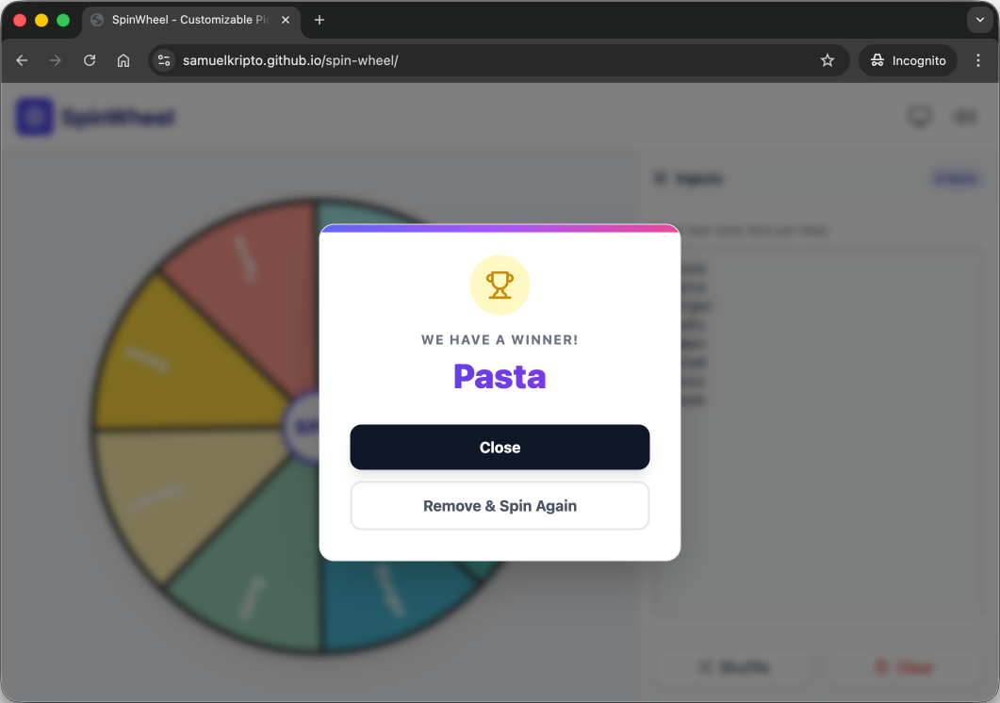

# SpinWheel

An interactive spin wheel progressive web application with a user progression system. Perfect for
making random selections, choosing winners, or making decisions in a fun and interactive way.

## About

This app allows users to create customizable spinning wheels for random selection and decision
making, while having fun doing so. Built as a single HTML page using pure HTML, Javascript, and CSS.
It is a lightweight spin wheel application that runs entirely in the browser. With the assistance of
Gemini 3 Pro, this app was built as to solve a real operational crisis of the technical team at
Samuel Kripto.

Screenshot:



## Features

- ✨ Core Features
  - **Interactive Spin Wheel**: Click to spin and randomly select an option.
  - **Customizable Options**: Add, edit, or remove wheel segments.
  - **Easy to Use**: Simple and intuitive interface.
  - **Single Page Application**: No server required, runs entirely in your browser.
  - **Lightweight**: Built with vanilla HTML, CSS, and JavaScript.
  - **Physics-Based Wheel**: The wheel is a disc with real inertia, bearing friction and air
    drag; it winds up under torque rather than jumping to speed, and nothing imposes a stop
    time. Spins end the way a real wheel does, often by stalling part-way up a pin and being
    pushed back down into the valley it came from -- how often is what the flapper tension
    setting controls, from almost never on light to most spins on brutal.
  - **Weighted Probabilities**: Support for weighted items using `Item:Weight` syntax
    (e.g., `Pizza:10`) to increase winning chances.
  - **Flapper Escapement**: The pointer is a spring-loaded cam follower, not decoration. Every
    pin it climbs takes energy out of the wheel, and the spin ends when it meets a pin it can no
    longer get over. One pin sits on each segment boundary, so which pin stops it is what picks
    the winner -- a little more energy and the wheel would have carried into the next slice.
    A pin touches the pointer over exactly the arc it is drawn across and no further, so the
    nose starts moving when the pin reaches it rather than a fifth of a segment early, and it
    swings as far as that pin could push it rather than five times as far.
  - **Coasts to a Stop**: Drag is dominated by air resistance rather than bearing friction, so
    speed decays exponentially instead of ramping down at a fixed rate into a halt. The wheel
    creeps through its last second, turning about two thirds of a degree before it settles.
  - **Anchored Pointer**: The pointer hangs from a fixed mount and each pin arriving under it
    swings its nose down, riding back up as the pin passes -- driven by the wheel actually
    pushing on it rather than by a position-keyed animation. The arm is not a rigid line from
    nose to pivot either: it whips past where the pin let go of it and rings back through its
    resting position before settling, the way a real one on a spring would.
  - **Never Dead Centre**: Between pins the pointer is touching nothing, so there is no spring
    pulling the wheel anywhere once it stops -- it comes to rest where it ran out of energy,
    which is anywhere across a valley rather than centred in one. When it does stop against a
    pin, the flapper grips it in proportion to how hard it is pressed and holds it there.
  - **Impact-Driven Sound**: Every strike is synthesized from its own contact force and speed
    and placed on the audio clock with sub-frame timing, under a bearing rumble that tracks
    wheel speed. Reverse strikes sound different from forward ones.
  - **Provably Fair**: `npm test` runs a headless Monte Carlo that chi-square tests the landing
    distribution against the item weights, across item counts, weightings, and every wheel
    weight, tension setting and pointer the app offers. The gate reads that list off the
    settings themselves, so a new one cannot ship ungated.
  - **List Management**: Create, rename, delete, and auto save multiple distinct lists
    (e.g., "Lunch Options", "Daily Standup", "Movie Night").
  - **Progress**: Track your XP progress, levels, and achievements. Earn XP points and unlock various
    achievements on every spin!
  - **SpinCoin**: Earn a coin on every spin and trade them for XP in the store, from a 10-coin
    starter pack up to 1000 coins for 3000 XP. Cosmetics are not on sale -- every pointer and
    tick sound is already free.
- 🎨 Visuals & UI
  - **3D Confetti**: Physics-based confetti engine with wind resistance, tumbling, and
    semi-transparent paper effects.
  - **Theme System**: Toggle between Auto (System), Light, and Dark modes.
  - **Responsive Design**: Fully optimized for mobile and desktop, with a "Single Page App" feel
    (no scrolling on desktop).
  - **Mystery Mode**: Toggle to hide item labels on the wheel ("?") for suspense.
  - **Interactive Power Meter**:
    - Tap-to-Spin: a quick click triggers an instant full-power spin.
    - Hold-to-Charge: Holding the button charges a power meter. Release to spin with the selected
      strength.
    - Visual Feedback: An animated ring fills up, changing color from blue to purple to red as power
      increases. The button shakes intensely at max power.
    - Overheating FX: Continuing to hold the button after full charge triggers an "Overheating"
      sequence.
  - **Wheel Color Editor**: Switch between default rainbow palette or define your own custom theme.
- 🤖 AI Integration (Gemini)
  - **AI List Generator**: Generate creative lists (e.g., "Dinner ideas") using the Sparkle button.
  - **AI Voice Announcer**: Optional Text-to-Speech announcement of the winner using Gemini's
    high-quality voices.
  - **Secure Settings**: Dedicated UI for managing and persisting the Gemini API Key.
- 🛠️ Utilities
  - **Persistence**: All settings (Inputs, History, Theme, API Key, Audio) are saved automatically
    to localStorage.
  - **History Tracking**: Logs winners with relative timestamps (e.g., "2 minutes ago") and exact
    ISO tooltips.
  - **PWA Support**: Installable as a standalone app on iOS and Android with custom icons and splash
    screen configuration.
  - **Share Functionality**: Export current lists via a shareable URL (Base64 encoded).

## Usage

1. Open the app [SpinWheel](https://samuelkripto.github.io/spinwheel/) in your web browser.
2. Add your custom options to the wheel.
3. Click the spin button to make a random selection.
4. The wheel will spin and land on one of your options.

### Weighted Items

You can customize the probability of each item winning by assigning a weight.

- Format: `Item Name:Weight`
- Higher number = Larger slice on the wheel.
- If no number is specified, it defaults to 1.

Example:

```text
Pizza:5
Burger :1
Sushi:  1
Salad  :  1
```

- Total Weight: `5 + 1 + 1 + 1 = 8`
- Pizza: Has 5/8 of the total wheel (approx 62% chance).
- Others: Each have 1/8 of the total wheel (approx 12.5% chance).
- If the user doesn't type a number (e.g., just "Ramen"), the system defaults that item's weight to 1.

### AI features

Get your Gemini API key from [Google AI Studio](https://aistudio.google.com/app/api-keys).

### Console Mode

The application supports a lightweight console mode for diagnostics and rapid testing.

- This mode is activated by creating a special list named `@console`.
- Commands are processed sequentially from top to bottom.
- Execution requires elevated permission, so this list must begin with the `#!sudo` directive before
  any command entries are executed.

Within console mode, you can issue several debugging commands/instructions:

| Command              | Description                                                                                     |
|----------------------|-------------------------------------------------------------------------------------------------|
| `toast:achievement`  | Toast animation for achievement unlocked.                                                       |
| `toast:quest`        | Toast animation for quest completed.                                                            |
| `toast:levelup`      | Toast animation for leveling up.                                                                |
| `toast:error`        | Toast animation for errors (e.g., Invalid API key).                                             |
| `toast:message`      | `message` can be surfaced through the toast notification system by using the syntax.            |
| `winner:name`        | `name` can be surfaced through the winner modal by using the syntax.                            |
| `confetti`           | Triggers the confetti animation at the current user's level.                                    |
| `confetti:level`     | Triggers the confetti animation at the specified `level`.                                       |
| `snowfall`           | Triggers the snowfall animation (for Christmas season).                                         |
| `break`              | Intentionally trigger a system failure (overheat).                                              |
| `theme:mode`         | Adjust the global theme. The enum value for `mode` is `auto` (or `system`), `light`, or `dark`. |
| `reset:achievements` | Reset all unlocked achievements.                                                                |
| `reset:quests`       | Reset all completed daily quests.                                                               |
| `reset:level`        | Reset the user level to 0.                                                                      |
| `reset`              | Restore the application to its default (factory) settings.                                      |

Cheats (intended solely for testing, _obviously_) can be enabled by executing `#!enable-cheats`
command to elevate permissions, before inputting any of the cheat commands. Once activated, the
following commands allow you to manipulate progression state:

| Command        | Description                                                                    |
|----------------|--------------------------------------------------------------------------------|
| `coins:amount` | Modify the 'SpinCoin' balance. The `amount` value may be positive or negative. |
| `xp:amount`    | Modify experience points. The `amount` value may be positive or negative.      |
| `levelup`      | Jump directly to the next level threshold.                                     |

### Special Keywords

The application includes a small set of special keywords that reveal additional contextual
information when discovered through normal gameplay. When these keywords appear and you successfully
spin to obtain them, they unlock brief informational panels.

- `@about` reveals the app’s background and purpose.
- `@author` provides details about the creator behind the project.

## How It Works

The wheel is drawn on an HTML5 Canvas and turned by a rigid-body solver rather than an
animation. A spin is an impulse; from there the wheel's inertia, its bearing friction and the
air drag on it decide how far it travels, and a spring-loaded flapper riding the pins on the
rim takes a little energy out of it at every crest.

Nothing picks a winner and steers the wheel to it. The result is whichever segment the pointer
is resting in once the wheel runs out of energy, which is why the landing distribution has to
be measured rather than asserted -- that is what `npm test` is for.

## Customization

You can customize:

- Theme (auto, light-mode, or dark-mode)
- Sound effects (on or off, electric, wooden, metallic, or crystal)
- Wheel weight (heavy, normal, or light — roughly 6s, 14s, or 22s at full power, though
  duration is emergent rather than fixed). Heavy is the *short* spin: it carries more drag as
  well as more inertia, so it sheds its energy sooner.
- Flapper tension (light, normal, strong, or brutal — how hard the pointer fights the wheel)
- Pointer (classic, sword, feather, or laser — each with its own mass and spring)
- Spin trail effects (on or off)
- Spin labels visibility (set it to hidden for a little bit of a "mystery" spin)

## Inspiration

This project is inspired by popular picker wheel websites like [PickerWheel.com](https://pickerwheel.com/),
bringing the same functionality in a simple, self-contained format.

## Getting Started

Simply clone this repository. No installation or build process required.

```bash
git clone https://github.com/samuelkripto/spinwheel.git
cd spinwheel
```

Serve locally using python3:

```bash
python3 -m http.server
```

> [!NOTE]
> This app's original intention is to be a simple project that requires no build/compilation stage
> and ease of deployment. Generally not a recommended approach for larger apps/projects, because
> this has known limitations such as:
>
> - using in-browser Babel compilation for JSX (less performant)
> - no performance optimizations (e.g., React 19's memoization)
> - partial TypeScript support
> - no minification process for final delivery

## License

This project is open source and available for personal, commercial, and educational use.

## Contributing

Contributions, issues, and feature requests are welcome! Feel free to check the issues page if you
want to contribute.
